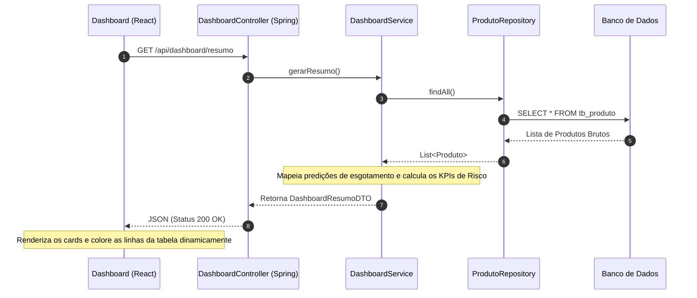

<h1 align="center">
  &nbsp;StarAge
</h1>
<p align="center">Sistema de Logística e Gestão de Estoque Terra-Lua — Global Solution FIAP 2026</p>
<p align="center">
  <a href="https://github.com/seu-usuario/starage"></a>&nbsp;
  <a href="https://github.com/seu-usuario/starage"></a>&nbsp;
  <a href="https://github.com/seu-usuario/starage"></a>&nbsp;
  <a href="https://github.com/seu-usuario/starage"></a>
</p>

<br>

<p align="center">
  
</p>

---

### 🪐 Sobre e Motivação do Projeto

O **StarAge** é uma plataforma de missão crítica projetada para gerenciar a cadeia de suprimentos e prever o esgotamento de recursos essenciais em bases operacionais na Lua. Em ambientes extraterrestres, a falta de insumos básicos como oxigênio, energia e kits de reparo estrutural pode comprometer vidas e infraestruturas em questão de horas.

O sistema atua centralizando os dados de inventário de múltiplos armazéns espaciais, executando algoritmos preditivos baseados em consumo médio diário e gerando alertas automáticos em três níveis de criticidade (`CRÍTICO`, `ATENÇÃO` e `SEGURO`).

**Funcionalidades Estratégicas:**
- **Algoritmo de Predição Estatística:** Calcula os dias restantes de estoque de forma dinâmica baseado no consumo diário real.
- **Segregação por Nível de Alerta:** Identificação visual imediata de insumos críticos de suporte à vida.
- **Integração IoT via MQTT:** Recepção de dados de sensores em tempo real através do broker Mosquitto.
- **Arquitetura Seeder Idempotente:** Mecanismo inteligente capaz de popular o banco de dados em ambientes limpos sem gerar registros duplicados em reinicializações consecutivas.
- **Painel de Controle Consolidado:** Dashboard moderno em tempo real focado na experiência do operador de logística espacial.

---

### 🛠️ Stack Tecnológica

| Camada | Tecnologia | Papel no Sistema |
| --- | --- | --- |
| **Backend** | Java 17+ · Spring Boot 3.x | Engine central, API RESTful e processamento de regras de negócio. |
| **Persistência** | Spring Data JPA · H2 / Oracle | Abstração de dados, consultas otimizadas e persistência íntegra. |
| **Mensageria IoT** | MQTT · Mosquitto Broker | Recepção assíncrona de dados de sensores dos armazéns espaciais. |
| **Segurança** | Spring Security · JWT | Autenticação baseada em tokens e controle de acesso por perfil. |
| **Documentação**| Springdoc OpenAPI (Swagger) | Especificação, testes vivos e documentação dos endpoints da API. |
| **Frontend** | React · Vite · JavaScript | Interface SPA (Single Page Application) performática e reativa. |
| **Estilização** | Tailwind CSS | Layout modularizado, design responsivo e paleta em Dark Mode. |
| **Infraestrutura** | Docker · Docker Compose | Orquestração de containers para o broker MQTT e demais serviços. |
| **Gerenciador** | NPM / Maven | Controle de dependências e automação de builds de ambas as camadas. |

---

### 📂 Estrutura de Pastas e Convenções

O projeto segue os princípios de separação de responsabilidades por meio de uma arquitetura limpa e desacoplada orientada ao domínio.

#### Estrutura Raiz do Projeto
```text
starage/
├── mosquitto/
│   └── config/
│       └── mosquitto.conf    # Configuração do broker MQTT
├── src/                      # Código-fonte do backend (Spring Boot)
├── starage-frontend/         # Aplicação frontend (React + Vite)
├── .env.example              # Variáveis de ambiente de exemplo
├── docker-compose.yml        # Orquestração dos serviços em container
├── mvnw / mvnw.cmd           # Maven Wrapper para execução do backend
└── pom.xml                   # Manifesto de dependências Maven
```

#### Estrutura do Backend (Spring Boot)
```text
src/main/java/br/com/fiap/starage/
├── application/
│   ├── dto/                        # Objetos de Transferência de Dados (Records imutáveis)
│   │   ├── ArmazemRequestDTO
│   │   ├── DadosAutenticacaoDTO
│   │   ├── DadosSensorDTO
│   │   ├── DashboardResumoDTO
│   │   ├── HistoricoConsumoResponseDTO
│   │   ├── PredicaoProdutoDTO
│   │   ├── ProdutoRequestDTO
│   │   └── ProdutoResponseDTO
│   └── service/                    # Classes de Serviço com regras de negócio e algoritmos
│       ├── AutenticacaoService
│       ├── DashboardService
│       ├── HistoricoConsumoService
│       ├── PredicaoConsumoService
│       ├── ProcessadorSensoresService
│       └── ProdutoService
├── domain/
│   ├── exception/                  # Exceções de domínio customizadas
│   ├── model/                      # Entidades ricas do domínio mapeadas para o banco
│   │   ├── Administrador
│   │   ├── Armazem
│   │   ├── GestorMunicipal
│   │   ├── HistoricoConsumo
│   │   ├── OperadorArmazem
│   │   ├── PerfilUsuario
│   │   ├── Produto
│   │   ├── StatusEstoque
│   │   └── Usuario
│   └── repository/                 # Interfaces de acesso a dados (Spring Data)
│       ├── ArmazemRepository
│       ├── HistoricoConsumoRepository
│       ├── ProdutoRepository
│       └── UsuarioRepository
├── infrastructure/
│   ├── config/                     # Configurações globais (CORS, Swagger, Seeder)
│   │   ├── CorsConfig
│   │   └── DatabaseSeeder
│   ├── messaging/                  # Integração com broker MQTT
│   │   └── MqttConfig
│   ├── persistence/                # Configurações de persistência
│   ├── scheduler/                  # Jobs agendados de processamento
│   └── security/                   # Segurança, autenticação JWT
│       ├── SecurityConfig
│       ├── SecurityFilter
│       └── TokenService
└── presentation/
    ├── controller/                 # Endpoints REST expostos para consumo da UI
    │   ├── ArmazemController
    │   ├── AuthController
    │   ├── DashboardController
    │   ├── HistoricoConsumoController
    │   ├── PredicaoController
    │   └── ProdutoController
    └── handler/                    # Tratamento global de exceções
        └── GlobalExceptionHandler
```

#### Estrutura do Frontend (React + Vite)
```text
starage-frontend/
├── public/           # Ativos estáticos públicos (Favicon, SVGs Globais)
├── src/
│   ├── assets/       # Imagens locais e mídias de suporte
│   ├── App.css       # Estilos específicos do componente raiz
│   ├── App.jsx       # Componente estrutural de roteamento e estados
│   ├── Dashboard.jsx # Painel principal de indicadores e listagem geral
│   ├── index.css     # Diretivas globais do Tailwind CSS (@tailwind)
│   └── main.jsx      # Ponto de entrada da aplicação na árvore DOM
├── .gitignore
├── eslint.config.js
├── index.html        # Template HTML da SPA
├── package.json      # Manifesto de dependências e scripts do Node
├── package-lock.json
├── postcss.config.js
├── tailwind.config.js# Customizações de cores, fontes e temas do Tailwind
└── vite.config.js    # Configuração do bundler Vite
```

#### Nomenclatura Padrão do Código
- **Classes e Interfaces:** `PascalCase` (ex: `DashboardService`, `ProdutoRepository`, `DashboardResumoDTO`).
- **Métodos e Variáveis:** `camelCase` (ex: `gerarResumo()`, `todosProdutos`, `totalProdutosCriticos`).
- **Constantes / Enums:** `UPPER_CASE` (ex: `CRITICO`, `ATENCAO`, `SEGURO`).
- **Componentes React:** `PascalCase` terminando em `.jsx` (ex: `Dashboard.jsx`).

---

### 🔄 Diagrama de Fluxo e Integração

O fluxo de dados transita de forma assíncrona entre o cliente (React) e o servidor (Spring Boot), alimentado por cálculos sob demanda da camada de serviço.



---

### 🚀 Como Executar o Projeto (Quick Start)

#### Pré-requisitos
- JDK 17+
- Node.js 18+
- Docker e Docker Compose (para o broker MQTT)

#### 1. Subindo a Infraestrutura (Mosquitto via Docker)
```bash
# Na raiz do projeto, suba o broker MQTT em container
docker-compose up -d
```
> O broker Mosquitto ficará disponível na porta padrão `1883`.

#### 2. Configurando as Variáveis de Ambiente
```bash
# Copie o arquivo de exemplo e ajuste as variáveis conforme seu ambiente
cp .env.example .env
```

#### 3. Executando o Backend
```bash
# Na raiz do projeto, execute o Maven Wrapper
./mvnw spring-boot:run
```
> A API estará disponível em `http://localhost:8080`. O console exibirá as mensagens do `DatabaseSeeder` confirmando a inserção segura dos dados.

#### 4. Executando o Frontend
```bash
# Navegue até o diretório do frontend
cd starage-frontend

# Instale as dependências declaradas no package.json
npm install

# Inicie o servidor de desenvolvimento do Vite
npm run dev
```
> O painel estará disponível localmente em `http://localhost:5173`.

---

### Telas

*Insira nesta seção as capturas de tela coletadas durante a validação da aplicação.*

#### 1. Interface do Dashboard Consolidado
Exibe os cards informativos de recursos em estado de criticidade, atenção e o status seguro integrado perfeitamente por cores reativas.

```text

```

#### 2. Documentação da API com Swagger UI
Visualização dos endpoints configurados e estruturados para testes manuais.

```text

```

#### 3. Payload de Resposta JSON (Endpoint de Resumo)
Evidência do contrato de dados retornando com os campos calculados, contagens exatas e arrays estruturados.

```text

```
